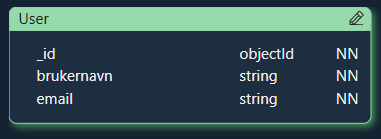
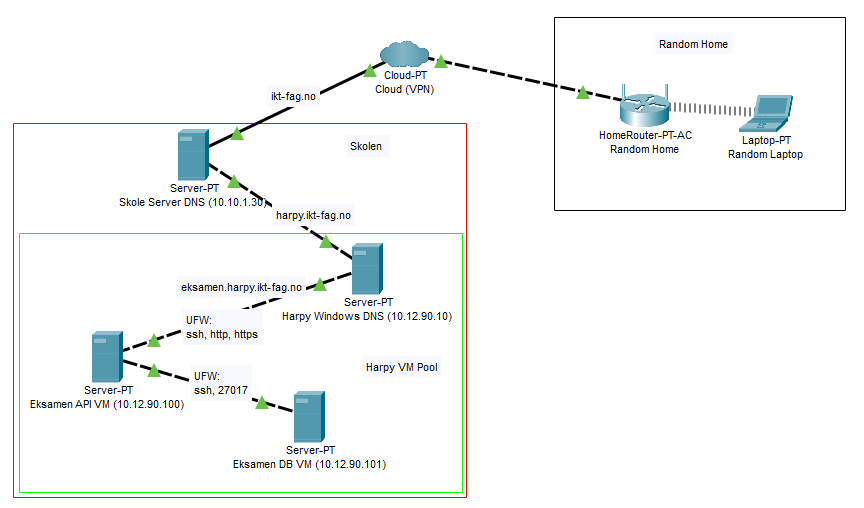

# Eksamen 2025

## Opprett bruker

**POST** `/api`

### Request Body

```json
{
    "brukernavn": "string",
    "email": "string"
}
```

### Response

**201 Created**

```json
{
    "success": true,
    "message": "Bruker opprettet",
    "data": {
        "user": {
            "_id": "string",
            "brukernavn": "string",
            "email": "string",
            "createdAt": "string",
            "updatedAt": "string"
        }
    }
}
```

**400 Bad Request**

```json
{
    "success": false,
    "message": "Feilmelding",
    "data": null
}
```

## Hent bruker

**GET** `/api/username`

### URL Parameters

-   `username` - Brukernavnet til brukeren som skal hentes

### Response

**200 OK**

```json
{
    "success": true,
    "message": "Bruker funnet",
    "data": {
        "user": {
            "_id": "string",
            "brukernavn": "string",
            "email": "string",
            "createdAt": "string",
            "updatedAt": "string"
        }
    }
}
```

**404 Not Found**

```json
{
    "success": false,
    "message": "Bruker ikke funnet.",
    "data": null
}
```

## IP table

| IP Address   | Description      |
| ------------ | ---------------- |
| 10.10.1.30   | Skole server DNS |
| 10.12.90.10  | Harpy DNS        |
| 10.12.90.100 | Eksamen API      |
| 10.12.90.101 | Eksamen DB       |

## Pictures

### ER Diagram



### Network Diagram


